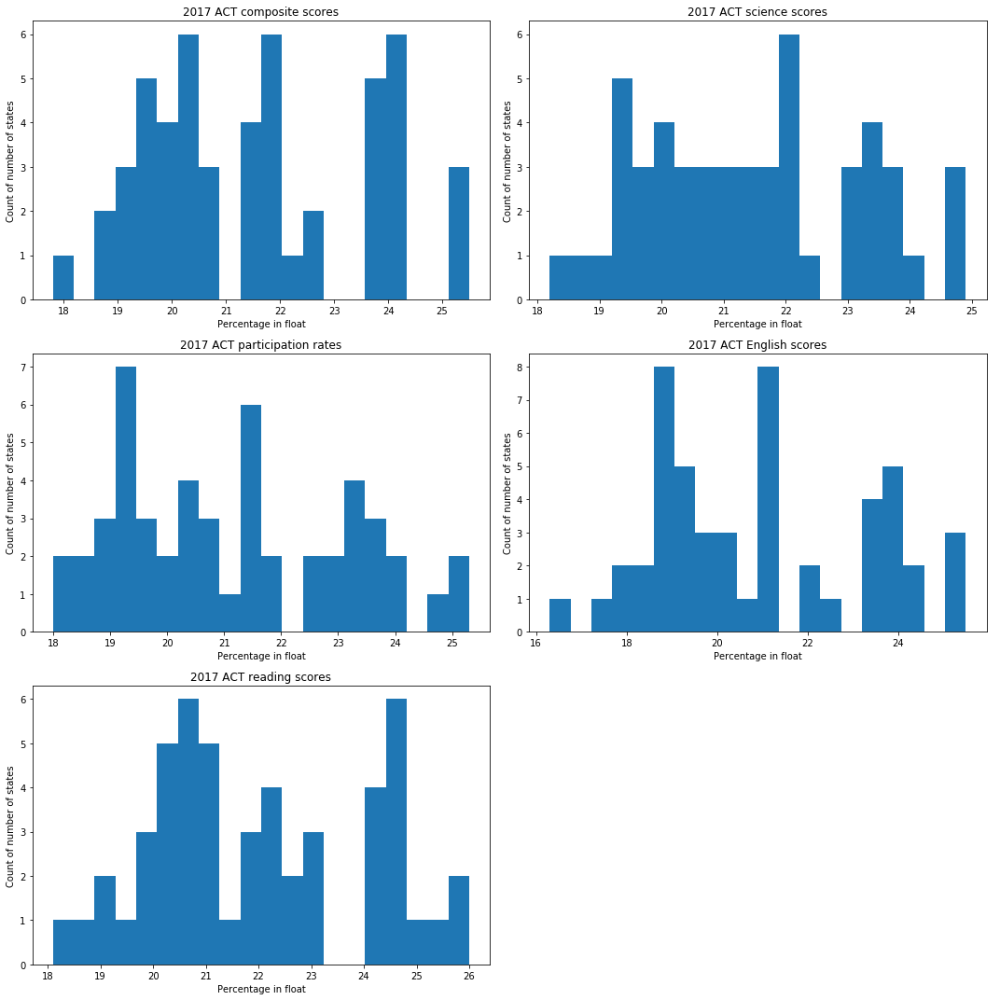

# Project 1: SAT & ACT Analysis

## Problem Statement

The new format for the SAT was released in March 2016 and since then, we have collected data on the scores from each state in US, and their corresponding participation rates in 2017. Based on the general statistics of the said given data, a rough estimate on each state's performance and their participation rate will be used to determine how federal funding shall be allocated into each state, so as to increase the education standards of the whole country.

The problem defined in this project therefore be looking at which specific subjects from either SAT or ACT test, see which subjects have a poor than average score for fiscal funding to be implemented to help improve education levels. Furthermore, we seek to also define how well we can use the test scores to predict future test scores.

The new format for the SAT was released in March 2016 and since then, we have collected data on the scores from each state in US, and their corresponding participation rates in 2017. Based on the general statistics of the said given data, a rough estimate on each state's performance and their participation rate will be used to determine how federal funding shall be allocated into each state, so as to increase the education standards of the whole country.

## Executive Summary

### Contents:
- [2017 Data Import & Cleaning](#Data-Import-and-Cleaning)
- [2018 Data Import and Cleaning](#2018-Data-Import-and-Cleaning)
- [Exploratory Data Analysis](#Exploratory-Data-Analysis)
- [Data Visualization](#Visualize-the-data)
- [Descriptive and Inferential Statistics](#Descriptive-and-Inferential-Statistics)
- [Outside Research](#Outside-Research)
- [Conclusions and Recommendations](#Conclusions-and-Recommendations)

**If you combine your problem statement, executive summary, data dictionary, and conclusions/recommendations, you have an amazing README.md file that quickly aligns your audience to the contents of your project.** Don't forget to cite your data sources!

*All libraries used should be added here*


```python
#Imports:
import pandas as pd
import matplotlib.pyplot as plt
import numpy as np
import seaborn as sns
import scipy.stats as stats

%matplotlib inline
```

## 2017 Data Import and Cleaning

#### 1. Read In SAT & ACT  Data

Read in the `sat_2017.csv` and `act_2017.csv` files and assign them to appropriately named pandas dataframes.

#### 1. Read In SAT & ACT  Data

Read in the `sat_2017.csv` and `act_2017.csv` files and assign them to appropriately named pandas dataframes.


```python
#Code:
sat_df = pd.read_csv('../data/sat_2017.csv')
act_df = pd.read_csv('../data/act_2017.csv')
```

#### 2. Display Data

Print the first 10 rows of each dataframe to your jupyter notebook


```python
#Code:
sat_df.head(10)
```


<div>

<table border="1" class="dataframe">
  <thead>
    <tr style="text-align: right;">
      <th></th>
      <th>State</th>
      <th>Participation</th>
      <th>Evidence-Based Reading and Writing</th>
      <th>Math</th>
      <th>Total</th>
    </tr>
  </thead>
  <tbody>
    <tr>
      <th>0</th>
      <td>Alabama</td>
      <td>5%</td>
      <td>593</td>
      <td>572</td>
      <td>1165</td>
    </tr>
    <tr>
      <th>1</th>
      <td>Alaska</td>
      <td>38%</td>
      <td>547</td>
      <td>533</td>
      <td>1080</td>
    </tr>
    <tr>
      <th>2</th>
      <td>Arizona</td>
      <td>30%</td>
      <td>563</td>
      <td>553</td>
      <td>1116</td>
    </tr>
    <tr>
      <th>3</th>
      <td>Arkansas</td>
      <td>3%</td>
      <td>614</td>
      <td>594</td>
      <td>1208</td>
    </tr>
    <tr>
      <th>4</th>
      <td>California</td>
      <td>53%</td>
      <td>531</td>
      <td>524</td>
      <td>1055</td>
    </tr>
    <tr>
      <th>5</th>
      <td>Colorado</td>
      <td>11%</td>
      <td>606</td>
      <td>595</td>
      <td>1201</td>
    </tr>
    <tr>
      <th>6</th>
      <td>Connecticut</td>
      <td>100%</td>
      <td>530</td>
      <td>512</td>
      <td>1041</td>
    </tr>
    <tr>
      <th>7</th>
      <td>Delaware</td>
      <td>100%</td>
      <td>503</td>
      <td>492</td>
      <td>996</td>
    </tr>
    <tr>
      <th>8</th>
      <td>District of Columbia</td>
      <td>100%</td>
      <td>482</td>
      <td>468</td>
      <td>950</td>
    </tr>
    <tr>
      <th>9</th>
      <td>Florida</td>
      <td>83%</td>
      <td>520</td>
      <td>497</td>
      <td>1017</td>
    </tr>
  </tbody>
</table>
</div>


```python
act_df.head(10)
```


<div>

<table border="1" class="dataframe">
  <thead>
    <tr style="text-align: right;">
      <th></th>
      <th>State</th>
      <th>Participation</th>
      <th>English</th>
      <th>Math</th>
      <th>Reading</th>
      <th>Science</th>
      <th>Composite</th>
    </tr>
  </thead>
  <tbody>
    <tr>
      <th>0</th>
      <td>National</td>
      <td>60%</td>
      <td>20.3</td>
      <td>20.7</td>
      <td>21.4</td>
      <td>21.0</td>
      <td>21.0</td>
    </tr>
    <tr>
      <th>1</th>
      <td>Alabama</td>
      <td>100%</td>
      <td>18.9</td>
      <td>18.4</td>
      <td>19.7</td>
      <td>19.4</td>
      <td>19.2</td>
    </tr>
    <tr>
      <th>2</th>
      <td>Alaska</td>
      <td>65%</td>
      <td>18.7</td>
      <td>19.8</td>
      <td>20.4</td>
      <td>19.9</td>
      <td>19.8</td>
    </tr>
    <tr>
      <th>3</th>
      <td>Arizona</td>
      <td>62%</td>
      <td>18.6</td>
      <td>19.8</td>
      <td>20.1</td>
      <td>19.8</td>
      <td>19.7</td>
    </tr>
    <tr>
      <th>4</th>
      <td>Arkansas</td>
      <td>100%</td>
      <td>18.9</td>
      <td>19.0</td>
      <td>19.7</td>
      <td>19.5</td>
      <td>19.4</td>
    </tr>
    <tr>
      <th>5</th>
      <td>California</td>
      <td>31%</td>
      <td>22.5</td>
      <td>22.7</td>
      <td>23.1</td>
      <td>22.2</td>
      <td>22.8</td>
    </tr>
    <tr>
      <th>6</th>
      <td>Colorado</td>
      <td>100%</td>
      <td>20.1</td>
      <td>20.3</td>
      <td>21.2</td>
      <td>20.9</td>
      <td>20.8</td>
    </tr>
    <tr>
      <th>7</th>
      <td>Connecticut</td>
      <td>31%</td>
      <td>25.5</td>
      <td>24.6</td>
      <td>25.6</td>
      <td>24.6</td>
      <td>25.2</td>
    </tr>
    <tr>
      <th>8</th>
      <td>Delaware</td>
      <td>18%</td>
      <td>24.1</td>
      <td>23.4</td>
      <td>24.8</td>
      <td>23.6</td>
      <td>24.1</td>
    </tr>
    <tr>
      <th>9</th>
      <td>District of Columbia</td>
      <td>32%</td>
      <td>24.4</td>
      <td>23.5</td>
      <td>24.9</td>
      <td>23.5</td>
      <td>24.2</td>
    </tr>
  </tbody>
</table>
</div>


#### 3. Verbally Describe Data

Take your time looking through the data and thoroughly describe the data in the markdown cell below. 

Answer:

### ACT dataset:
---
For the ACT dataset, it is observed that there is an extra row within the dataset (National results). Upon inspection with a box plot, there is also an outlier within the science column. This has caused the skewness of the science to be extremely negative (-4.136).

Upon checking the datatypes of each labels too, the label of composite is specified as object, signifying that there might be a mix of integers and strings within the dataset. After inspection, it is found that for label composite, the last row has the integer mixed with a string 'x'. Furthermore, the data type of participation is not in float, and thus unable to be plotted.


### SAT dataset:
---
For the SAT dataset, the boxplot for Math, there also exist an outlier which is detected. The skewness due to this outlier, is therefore negatively skewed by -3.971.

Similarly, the participation column for SAT data is not in the proper data type of float (currently as object).


```python
sat_df.plot.box()
```


    <matplotlib.axes._subplots.AxesSubplot at 0x2fc70e4a58>


```python
act_df.skew()
```


    English    0.370977
    Math       0.349583
    Reading    0.288556
    Science   -4.136275
    dtype: float64


```python
sat_df.dtypes
```


    State                                 object
    Participation                         object
    Evidence-Based Reading and Writing     int64
    Math                                   int64
    Total                                  int64
    dtype: object


#### 4a. Does the data look complete? 

Answer: 

It can be observed that for both datasets, the number of counts for each of the subjects are all equal, thus there are no missing data. Furthermore, checking with code act_df.isnull().values.any() and sat_df.isnull().values.any() retuned False for both dataset. Thus, ensuring tat all fields are indeed filled up with a unique object.

However, erroneous data could still be found inside the dataset.


```python
act_df.isnull().sum()
```


    State            0
    Participation    0
    English          0
    Math             0
    Reading          0
    Science          0
    Composite        0
    dtype: int64


```python
sat_df.info()
```

    <class 'pandas.core.frame.DataFrame'>
    RangeIndex: 51 entries, 0 to 50
    Data columns (total 5 columns):
    State                                 51 non-null object
    Participation                         51 non-null object
    Evidence-Based Reading and Writing    51 non-null int64
    Math                                  51 non-null int64
    Total                                 51 non-null int64
    dtypes: int64(3), object(2)
    memory usage: 2.1+ KB
    


```python
act_df.info()
```

    <class 'pandas.core.frame.DataFrame'>
    RangeIndex: 52 entries, 0 to 51
    Data columns (total 7 columns):
    State            52 non-null object
    Participation    52 non-null object
    English          52 non-null float64
    Math             52 non-null float64
    Reading          52 non-null float64
    Science          52 non-null float64
    Composite        52 non-null object
    dtypes: float64(4), object(3)
    memory usage: 2.9+ KB
    

#### 4b. Are there any obvious issues with the observations?

**What is the minimum *possible* value for each test/subtest? What is the maximum *possible* value?**

Consider comparing any questionable values to the sources of your data:
- [SAT](https://blog.collegevine.com/here-are-the-average-sat-scores-by-state/)
- [ACT](https://blog.prepscholar.com/act-scores-by-state-averages-highs-and-lows)

Answer: 

For SAT sections in ERW and Math, the minimum possible value is 200 while the maximum possible value is 800. In sum, the total scores minimum is 400 and maximum is 1600.

For ACT sections, the minimum possible is 1, while the maximum possible is 36 for all sections, including the composite scores.


#### 4c. Fix any errors you identified

**The data is available** so there's no need to guess or calculate anything. If you didn't find any errors, continue to the next step.

Based on the maximum and minimum possible values of SAT and ACT, it can be seen that there are outliers in the SAT math score (score of 52), which is outside of the possibility of 200. This can be fixed however, by using the total scores minusing the ERW scores to get the math score.

Furthermore, several of the scores do not tally, as ERW + math does not equal to total. Many of them are off by a little. Thus, after correcting for the outlier math score, the new total score can be tallied through addition from ERW and new math

As for the outlier in ACT science section, the score if 2.3 is well below the mean, it still falls under the range of possible scores, but as compared to the original dataset, this data is wrong.


```python
sat_df.loc[20,'Math'] = 524
act_df.loc[21,'Science'] = 23.2
sat_df["New Total"] = sat_df['Math']+sat_df['Evidence-Based Reading and Writing']
sat_df.drop(columns = 'Total',inplace=True)

```


```python
sat_df.head(10)
```


<div>

<table border="1" class="dataframe">
  <thead>
    <tr style="text-align: right;">
      <th></th>
      <th>State</th>
      <th>Participation</th>
      <th>Evidence-Based Reading and Writing</th>
      <th>Math</th>
      <th>New Total</th>
    </tr>
  </thead>
  <tbody>
    <tr>
      <th>0</th>
      <td>Alabama</td>
      <td>5%</td>
      <td>593</td>
      <td>572</td>
      <td>1165</td>
    </tr>
    <tr>
      <th>1</th>
      <td>Alaska</td>
      <td>38%</td>
      <td>547</td>
      <td>533</td>
      <td>1080</td>
    </tr>
    <tr>
      <th>2</th>
      <td>Arizona</td>
      <td>30%</td>
      <td>563</td>
      <td>553</td>
      <td>1116</td>
    </tr>
    <tr>
      <th>3</th>
      <td>Arkansas</td>
      <td>3%</td>
      <td>614</td>
      <td>594</td>
      <td>1208</td>
    </tr>
    <tr>
      <th>4</th>
      <td>California</td>
      <td>53%</td>
      <td>531</td>
      <td>524</td>
      <td>1055</td>
    </tr>
    <tr>
      <th>5</th>
      <td>Colorado</td>
      <td>11%</td>
      <td>606</td>
      <td>595</td>
      <td>1201</td>
    </tr>
    <tr>
      <th>6</th>
      <td>Connecticut</td>
      <td>100%</td>
      <td>530</td>
      <td>512</td>
      <td>1042</td>
    </tr>
    <tr>
      <th>7</th>
      <td>Delaware</td>
      <td>100%</td>
      <td>503</td>
      <td>492</td>
      <td>995</td>
    </tr>
    <tr>
      <th>8</th>
      <td>District of Columbia</td>
      <td>100%</td>
      <td>482</td>
      <td>468</td>
      <td>950</td>
    </tr>
    <tr>
      <th>9</th>
      <td>Florida</td>
      <td>83%</td>
      <td>520</td>
      <td>497</td>
      <td>1017</td>
    </tr>
  </tbody>
</table>
</div>


#### 5. What are your data types? 
Display the data types of each feature. 


```python
#code
print(sat_df.dtypes)
print('')
print(act_df.dtypes)
```

    State                                 object
    Participation                         object
    Evidence-Based Reading and Writing     int64
    Math                                   int64
    New Total                              int64
    dtype: object
    
    State             object
    Participation     object
    English          float64
    Math             float64
    Reading          float64
    Science          float64
    Composite         object
    dtype: object
    

What did you learn?
- Do any of them seem odd?  
- Which ones are not as they should be?  

Answer:<br>
1) The dtype of composite in the act_df data is an object instead of float, as it is still a float score. <br>
2) For both participation columns in SAT and ACT dataset, the data type is objects instead of float. <br>
3) For both datasets, the state is in object instead of a string

#### 6. Fix Incorrect Data Types
Based on what you discovered above, use appropriate methods to re-type incorrectly typed data.
- Define a function that will allow you to convert participation rates to an appropriate numeric type. Use `map` or `apply` to change these columns in each dataframe.


```python
#code
def p2f(x):
    return x.str.replace('%','').astype(float)/100
```


```python
sat_df['Participation'] = p2f(sat_df['Participation'])
act_df['Participation'] = p2f(act_df['Participation'])
```

- Fix any individual values preventing other columns from being the appropriate type.


```python
#code
act_df['Composite'] = act_df['Composite'].str.replace('x', '')
```


```python
#code
any(i.isalpha() for i in act_df['Composite'])  #Does not contain any characters

```


    False


- Finish your data modifications by making sure the columns are now typed appropriately.


```python
act_df['Composite'] = act_df['Composite'].astype(float)
```

- Display the data types again to confirm they are correct.


```python
#Code:
print(sat_df.dtypes)
print('')
print(act_df.dtypes)
```

    State                                  object
    Participation                         float64
    Evidence-Based Reading and Writing      int64
    Math                                    int64
    New Total                               int64
    dtype: object
    
    State             object
    Participation    float64
    English          float64
    Math             float64
    Reading          float64
    Science          float64
    Composite        float64
    dtype: object
    

#### 7. Rename Columns
Change the names of the columns to more expressive names so that you can tell the difference the SAT columns and the ACT columns. Your solution should map all column names being changed at once (no repeated singular name-changes). **We will be combining these data with some of the data from 2018, and so you should name columns in an appropriate way**.

**Guidelines**:
- Column names should be all lowercase (you will thank yourself when you start pushing data to SQL later in the course)
- Column names should not contain spaces (underscores will suffice--this allows for using the `df.column_name` method to access columns in addition to `df['column_name']`.
- Column names should be unique and informative (the only feature that we actually share between dataframes is the state).


```python
#code
sat17_df = sat_df.rename(columns={'Participation':'sat_17_participation',
                       'Evidence-Based Reading and Writing':'sat_17_erw',
                       'Math':'sat_17_math',
                      'New Total':'sat_17_total'})
act17_df = act_df.rename(columns={'Participation':'act_17_participation',
                       'English':'act_17_english',
                       'Math':'act_17_math',
                      'Reading':'act_17_reading',
                      'Science':'act_17_science',
                      'Composite':'act_17_composite'})
```


```python
act17_df.head()
```


<div>

<table border="1" class="dataframe">
  <thead>
    <tr style="text-align: right;">
      <th></th>
      <th>State</th>
      <th>act_17_participation</th>
      <th>act_17_english</th>
      <th>act_17_math</th>
      <th>act_17_reading</th>
      <th>act_17_science</th>
      <th>act_17_composite</th>
    </tr>
  </thead>
  <tbody>
    <tr>
      <th>0</th>
      <td>National</td>
      <td>0.60</td>
      <td>20.3</td>
      <td>20.7</td>
      <td>21.4</td>
      <td>21.0</td>
      <td>21.0</td>
    </tr>
    <tr>
      <th>1</th>
      <td>Alabama</td>
      <td>1.00</td>
      <td>18.9</td>
      <td>18.4</td>
      <td>19.7</td>
      <td>19.4</td>
      <td>19.2</td>
    </tr>
    <tr>
      <th>2</th>
      <td>Alaska</td>
      <td>0.65</td>
      <td>18.7</td>
      <td>19.8</td>
      <td>20.4</td>
      <td>19.9</td>
      <td>19.8</td>
    </tr>
    <tr>
      <th>3</th>
      <td>Arizona</td>
      <td>0.62</td>
      <td>18.6</td>
      <td>19.8</td>
      <td>20.1</td>
      <td>19.8</td>
      <td>19.7</td>
    </tr>
    <tr>
      <th>4</th>
      <td>Arkansas</td>
      <td>1.00</td>
      <td>18.9</td>
      <td>19.0</td>
      <td>19.7</td>
      <td>19.5</td>
      <td>19.4</td>
    </tr>
  </tbody>
</table>
</div>


#### 8. Create a data dictionary

Now that we've fixed our data, and given it appropriate names, let's create a [data dictionary](http://library.ucmerced.edu/node/10249). 

A data dictionary provides a quick overview of features/variables/columns, alongside data types and descriptions. The more descriptive you can be, the more useful this document is.

Example of a Fictional Data Dictionary Entry: 

|Feature|Type|Dataset|Description|
|---|---|---|---|
|**county_pop**|*integer*|2010 census|The population of the county (units in thousands, where 2.5 represents 2500 people).| 
|**per_poverty**|*float*|2010 census|The percent of the county over the age of 18 living below the 200% of official US poverty rate (units percent to two decimal places 98.10 means 98.1%)|

[Here's a quick link to a short guide for formatting markdown in Jupyter notebooks](https://jupyter-notebook.readthedocs.io/en/stable/examples/Notebook/Working%20With%20Markdown%20Cells.html).

Provided is the skeleton for formatting a markdown table, with columns headers that will help you create a data dictionary to quickly summarize your data, as well as some examples. **This would be a great thing to copy and paste into your custom README for this project.**

|Feature|Type|Dataset|Description|
|---|---|---|---|
|State|string|ACT/SAT|The list of states in United States of America (51, including District of Columbia)| 
|Participation|float|ACT/SAT|The percentage of high school graduate who takes the ACT/SAT test|
|Evidence-Based Reading and Writing (ERW) |integer|SAT|Score on Evidence-Based Reading and Writing (range from 200-800)|
|Math|integer|SAT|Score on Math (range from 200-800)|
|Total|integer|SAT|Sum of scores of ERW and Math (range from 400-1600)|
|English|float|ACT|Scaled score on English subject (range from 1-36)|
|Math|float|ACT|Scaled score on Math subject (range from 1-36)|
|Reading|float|ACT|Scaled score on Reading subject (range from 1-36)|
|Science|float|ACT|Scaled score on Science subject (range from 1-36)|
|Composite|float|ACT|Average of scaled scores on the 4 ACT subjects (English, Math, Reading, Science)|
|17 or 18 in label row|label|Combined|The year tag 2017 or 2018 depicting scores from 2017 or 2018|


#### 9. Drop unnecessary rows

One of our dataframes contains an extra row. Identify and remove this from the dataframe.


```python
#code
#National row is included in the ACT dataset. Drop national row.
act17_df = act17_df[act17_df["State"]!="National"]
```

#### 10. Merge Dataframes

Join the 2017 ACT and SAT dataframes using the state in each dataframe as the key. Assign this to a new variable.


```python
#Code:
combined_2017 = pd.merge(act17_df,sat17_df,how='inner',on="State")
```

#### 11. Save your cleaned, merged dataframe

Use a relative path to save out your data as `combined_2017.csv`.


```python
#code
combined_2017.to_csv('..\data\combined_2017.csv')
```

## 2018 Data Import and Cleaning

Links to the 2018 ACT and SAT data are provided in the README. These data live in PDFs, and so you'll get to enjoy practicing some *manual* data collection. Save these data as a CSV in your `data` directory, and import, explore, and clean these data in the same way you did above. **Make sure you comment on your steps so it is clear *why* you are doing each process**.


```python

sat18_df = pd.read_csv('../data/SAT_2018.csv')                               #Import all data and pandas read dataframe
act18_df = pd.read_csv('../data/ACT_2018.csv')

act18_df = act18_df[act18_df["State"]!="National"]                         #Removing National statistics from act 2018 series

act18_df['Participation'] = p2f(act18_df['Participation'])      #converting participation column from object to float using 
sat18_df['Participation'] = p2f(sat18_df['Participation'])      #previously defined p2f function

sat18_df = sat18_df.rename(columns={'Participation':'sat_18_participation',   #renaming columns for merging
                       'Evidence-Based Reading and Writing':'sat_18_erw',
                       'Math':'sat_18_math',
                      'Total':'sat_18_total'})
act18_df = act18_df.rename(columns={'Participation':'act_18_participation',
                       'English':'act_18_english',
                       'Math':'act_18_math',
                      'Reading':'act_18_reading',
                      'Science':'act_18_science',
                      'Composite':'act_18_composite'})

combined_2018 = pd.merge(act18_df,sat18_df,how='inner',on="State")          #merge 2018 dataset into combined
```


```python
combined_2018.to_csv('..\data\combined_2018.csv')
```

#### Combine your 2017 and 2018 data into a single dataframe
Joining on state names should work, assuming you formatted all your state names identically. Make sure none of your columns (other than state) have identical names. Do yourself a favor and decide if you're encoding participation rates as floats or integers and standardize this across your datasets.

Save the contents of this merged dataframe as `final.csv`.

**Use this combined dataframe for the remainder of the project**.


```python
final = pd.merge(combined_2018,combined_2017,how='inner',on="State")
```


```python
final.to_csv('..\data\Final.csv')
```

## Exploratory Data Analysis


### Summary Statistics
Transpose the output of pandas `describe` method to create a quick overview of each numeric feature.


```python
#Code:
final.describe().transpose()
```


<div>

<table border="1" class="dataframe">
  <thead>
    <tr style="text-align: right;">
      <th></th>
      <th>count</th>
      <th>mean</th>
      <th>std</th>
      <th>min</th>
      <th>25%</th>
      <th>50%</th>
      <th>75%</th>
      <th>max</th>
    </tr>
  </thead>
  <tbody>
    <tr>
      <th>act_18_participation</th>
      <td>51.0</td>
      <td>0.616471</td>
      <td>0.340810</td>
      <td>0.07</td>
      <td>0.285</td>
      <td>0.66</td>
      <td>1.000</td>
      <td>1.0</td>
    </tr>
    <tr>
      <th>act_18_composite</th>
      <td>51.0</td>
      <td>21.486275</td>
      <td>2.106278</td>
      <td>17.70</td>
      <td>19.950</td>
      <td>21.30</td>
      <td>23.550</td>
      <td>25.6</td>
    </tr>
    <tr>
      <th>act_18_english</th>
      <td>51.0</td>
      <td>20.988235</td>
      <td>2.446356</td>
      <td>16.60</td>
      <td>19.100</td>
      <td>20.20</td>
      <td>23.700</td>
      <td>26.0</td>
    </tr>
    <tr>
      <th>act_18_math</th>
      <td>51.0</td>
      <td>21.125490</td>
      <td>2.035765</td>
      <td>17.80</td>
      <td>19.400</td>
      <td>20.70</td>
      <td>23.150</td>
      <td>25.2</td>
    </tr>
    <tr>
      <th>act_18_reading</th>
      <td>51.0</td>
      <td>22.015686</td>
      <td>2.167245</td>
      <td>18.00</td>
      <td>20.450</td>
      <td>21.60</td>
      <td>24.100</td>
      <td>26.1</td>
    </tr>
    <tr>
      <th>act_18_science</th>
      <td>51.0</td>
      <td>21.345098</td>
      <td>1.870114</td>
      <td>17.90</td>
      <td>19.850</td>
      <td>21.10</td>
      <td>23.050</td>
      <td>24.9</td>
    </tr>
    <tr>
      <th>sat_18_participation</th>
      <td>51.0</td>
      <td>0.466275</td>
      <td>0.380142</td>
      <td>0.02</td>
      <td>0.045</td>
      <td>0.52</td>
      <td>0.795</td>
      <td>1.0</td>
    </tr>
    <tr>
      <th>sat_18_erw</th>
      <td>51.0</td>
      <td>567.294118</td>
      <td>45.317676</td>
      <td>497.00</td>
      <td>535.000</td>
      <td>552.00</td>
      <td>616.500</td>
      <td>643.0</td>
    </tr>
    <tr>
      <th>sat_18_math</th>
      <td>51.0</td>
      <td>557.254902</td>
      <td>48.887562</td>
      <td>480.00</td>
      <td>521.500</td>
      <td>547.00</td>
      <td>600.500</td>
      <td>655.0</td>
    </tr>
    <tr>
      <th>sat_18_total</th>
      <td>51.0</td>
      <td>1124.666667</td>
      <td>93.867069</td>
      <td>977.00</td>
      <td>1062.500</td>
      <td>1099.00</td>
      <td>1220.000</td>
      <td>1298.0</td>
    </tr>
    <tr>
      <th>act_17_participation</th>
      <td>51.0</td>
      <td>0.652549</td>
      <td>0.321408</td>
      <td>0.08</td>
      <td>0.310</td>
      <td>0.69</td>
      <td>1.000</td>
      <td>1.0</td>
    </tr>
    <tr>
      <th>act_17_english</th>
      <td>51.0</td>
      <td>20.931373</td>
      <td>2.353677</td>
      <td>16.30</td>
      <td>19.000</td>
      <td>20.70</td>
      <td>23.300</td>
      <td>25.5</td>
    </tr>
    <tr>
      <th>act_17_math</th>
      <td>51.0</td>
      <td>21.182353</td>
      <td>1.981989</td>
      <td>18.00</td>
      <td>19.400</td>
      <td>20.90</td>
      <td>23.100</td>
      <td>25.3</td>
    </tr>
    <tr>
      <th>act_17_reading</th>
      <td>51.0</td>
      <td>22.013725</td>
      <td>2.067271</td>
      <td>18.10</td>
      <td>20.450</td>
      <td>21.80</td>
      <td>24.150</td>
      <td>26.0</td>
    </tr>
    <tr>
      <th>act_17_science</th>
      <td>51.0</td>
      <td>21.450980</td>
      <td>1.739353</td>
      <td>18.20</td>
      <td>19.950</td>
      <td>21.30</td>
      <td>23.200</td>
      <td>24.9</td>
    </tr>
    <tr>
      <th>act_17_composite</th>
      <td>51.0</td>
      <td>21.519608</td>
      <td>2.020695</td>
      <td>17.80</td>
      <td>19.800</td>
      <td>21.40</td>
      <td>23.600</td>
      <td>25.5</td>
    </tr>
    <tr>
      <th>sat_17_participation</th>
      <td>51.0</td>
      <td>0.398039</td>
      <td>0.352766</td>
      <td>0.02</td>
      <td>0.040</td>
      <td>0.38</td>
      <td>0.660</td>
      <td>1.0</td>
    </tr>
    <tr>
      <th>sat_17_erw</th>
      <td>51.0</td>
      <td>569.117647</td>
      <td>45.666901</td>
      <td>482.00</td>
      <td>533.500</td>
      <td>559.00</td>
      <td>613.000</td>
      <td>644.0</td>
    </tr>
    <tr>
      <th>sat_17_math</th>
      <td>51.0</td>
      <td>556.882353</td>
      <td>47.121395</td>
      <td>468.00</td>
      <td>523.500</td>
      <td>548.00</td>
      <td>599.000</td>
      <td>651.0</td>
    </tr>
    <tr>
      <th>sat_17_total</th>
      <td>51.0</td>
      <td>1126.000000</td>
      <td>92.487621</td>
      <td>950.00</td>
      <td>1055.500</td>
      <td>1106.00</td>
      <td>1211.500</td>
      <td>1295.0</td>
    </tr>
  </tbody>
</table>
</div>


#### Manually calculate standard deviation

$$\sigma = \sqrt{\frac{1}{n}\sum_{i=1}^n(x_i - \mu)^2}$$

- Write a function to calculate standard deviation using the formula above


```python
#code
def calc_stdev(x):
    total = 0
    sum_differences = 0
    for i in x:
        total += i
    mean = total/len(x)
    for j in x:
        differences = 0
        differences = (j - mean)**2
        sum_differences += differences
    stdev = (1/len(x) * sum_differences)**0.5         #    stdev = (1/(len(x)-1) * sum_differences)**0.5 for bessel's correction
    return stdev
```


```python
calc_stdev(final['sat_17_total'])
```


    91.57639048421622


- Use a **dictionary comprehension** to apply your standard deviation function to each numeric column in the dataframe.  **No loops**  
- Assign the output to variable `sd` as a dictionary where: 
    - Each column name is now a key 
    - That standard deviation of the column is the value 
     
*Example Output :* `{'ACT_Math': 120, 'ACT_Reading': 120, ...}`


```python
#Code:
sd = {x:calc_stdev(final[x]) for x in final if x!='State'}
```


```python
sd
```


    {'act_18_participation': 0.33745194881997503,
     'act_18_composite': 2.0855261815801147,
     'act_18_english': 2.4222536143202795,
     'act_18_math': 2.015707255555717,
     'act_18_reading': 2.145891884510421,
     'act_18_science': 1.8516885484833543,
     'sat_18_participation': 0.3763965409204987,
     'sat_18_erw': 44.87118561762388,
     'sat_18_math': 48.40589946919447,
     'sat_18_total': 92.94224786343668,
     'act_17_participation': 0.3182417575123181,
     'act_17_english': 2.3304876369363363,
     'act_17_math': 1.9624620273436781,
     'act_17_reading': 2.0469029314842646,
     'act_17_science': 1.7222161451443676,
     'act_17_composite': 2.000786081581989,
     'sat_17_participation': 0.3492907076664507,
     'sat_17_erw': 45.21697020437866,
     'sat_17_math': 46.65713364485503,
     'sat_17_total': 91.57639048421622}


Do your manually calculated standard deviations match up with the output from pandas `describe`? What about numpy's `std` method?

Answer: <br>
No, the standard deviations do not match up. However, Numpy's std method also matches up. This is because the formula above does not correct for bessel's correction as the estimation of the population variance contains bias. Bessel's correction partially corrects the bias in the estimation of the population standard deviation by using n-1 instead of n instances only in pandas package. For numpy to correct for bessel's correction, we need to include a parameter, (ddof = 1)

#### Investigate trends in the data
Using sorting and/or masking (along with the `.head` method to not print our entire dataframe), consider the following questions:

- Which states have the highest and lowest participation rates for the:
    - 2017 SAT? 
    - 2018 SAT? 
    - 2017 ACT? 
    - 2018 ACT?
- Which states have the highest and lowest mean total/composite scores for the:
    - 2017 SAT?
    - 2018 SAT?
    - 2017 ACT?
    - 2018 ACT?
- Do any states with 100% participation on a given test have a rate change year-to-year?
- Do any states show have >50% participation on *both* tests either year?

Based on what you've just observed, have you identified any states that you're especially interested in? **Make a note of these and state *why* you think they're interesting**.

**You should comment on your findings at each step in a markdown cell below your code block**. Make sure you include at least one example of sorting your dataframe by a column, and one example of using boolean filtering (i.e., masking) to select a subset of the dataframe.


```python
#code

def find_lowest(col):                 #function to find the lowest in said column name and return the dataframe with 
    lowest = 1000                      #only those frames
    for i in col:
        if i <= lowest:
            lowest = i                 #i will be the lowest in the column
    x = final[col == lowest]
    return x

def find_highest(col):
    highest = 1
    for i in col:
        if i >= highest:
            highest = i 
    x = final[col == highest]
    return x
    
def high_low(col):
    print('--Lowest_--')
    for i in find_lowest(col).State:
        print(i)
    print('--Highest--')
    for i in find_highest(col).State:
        print(i)
    return None
```


```python
high_low(final['sat_17_participation'])
```

    --Lowest_--
    Iowa
    Mississippi
    North Dakota
    --Highest--
    Connecticut
    Delaware
    District of Columbia
    Michigan
    


```python
high_low(final['sat_18_participation'])
```

    --Lowest_--
    North Dakota
    --Highest--
    Colorado
    Connecticut
    Delaware
    Idaho
    Michigan
    


```python
high_low(final['act_17_participation'])
```

    --Lowest_--
    Maine
    --Highest--
    Alabama
    Arkansas
    Colorado
    Kentucky
    Louisiana
    Minnesota
    Mississippi
    Missouri
    Montana
    Nevada
    North Carolina
    Oklahoma
    South Carolina
    Tennessee
    Utah
    Wisconsin
    Wyoming
    


```python
high_low(final['act_18_participation'])
```

    --Lowest_--
    Maine
    --Highest--
    Alabama
    Arkansas
    Kentucky
    Louisiana
    Mississippi
    Missouri
    Montana
    Nebraska
    Nevada
    North Carolina
    Ohio
    Oklahoma
    South Carolina
    Tennessee
    Utah
    Wisconsin
    Wyoming
    


```python
high_low(final['sat_17_total'])
```

    --Lowest_--
    District of Columbia
    --Highest--
    Minnesota
    


```python
high_low(final['sat_18_total'])
```

    --Lowest_--
    District of Columbia
    --Highest--
    Minnesota
    


```python
high_low(final['act_17_composite'])
```

    --Lowest_--
    Nevada
    --Highest--
    New Hampshire
    


```python
high_low(final['act_18_composite'])
```

    --Lowest_--
    Nevada
    --Highest--
    Connecticut
    


```python
final[['State','act_17_participation','act_18_participation']]\
.sort_values(by = ['act_18_participation','act_17_participation'], ascending = [True, False]).\
tail(20)
```


<div>

<table border="1" class="dataframe">
  <thead>
    <tr style="text-align: right;">
      <th></th>
      <th>State</th>
      <th>act_17_participation</th>
      <th>act_18_participation</th>
    </tr>
  </thead>
  <tbody>
    <tr>
      <th>11</th>
      <td>Hawaii</td>
      <td>0.90</td>
      <td>0.89</td>
    </tr>
    <tr>
      <th>34</th>
      <td>North Dakota</td>
      <td>0.98</td>
      <td>0.98</td>
    </tr>
    <tr>
      <th>23</th>
      <td>Minnesota</td>
      <td>1.00</td>
      <td>0.99</td>
    </tr>
    <tr>
      <th>0</th>
      <td>Alabama</td>
      <td>1.00</td>
      <td>1.00</td>
    </tr>
    <tr>
      <th>3</th>
      <td>Arkansas</td>
      <td>1.00</td>
      <td>1.00</td>
    </tr>
    <tr>
      <th>17</th>
      <td>Kentucky</td>
      <td>1.00</td>
      <td>1.00</td>
    </tr>
    <tr>
      <th>18</th>
      <td>Louisiana</td>
      <td>1.00</td>
      <td>1.00</td>
    </tr>
    <tr>
      <th>24</th>
      <td>Mississippi</td>
      <td>1.00</td>
      <td>1.00</td>
    </tr>
    <tr>
      <th>25</th>
      <td>Missouri</td>
      <td>1.00</td>
      <td>1.00</td>
    </tr>
    <tr>
      <th>26</th>
      <td>Montana</td>
      <td>1.00</td>
      <td>1.00</td>
    </tr>
    <tr>
      <th>28</th>
      <td>Nevada</td>
      <td>1.00</td>
      <td>1.00</td>
    </tr>
    <tr>
      <th>33</th>
      <td>North Carolina</td>
      <td>1.00</td>
      <td>1.00</td>
    </tr>
    <tr>
      <th>36</th>
      <td>Oklahoma</td>
      <td>1.00</td>
      <td>1.00</td>
    </tr>
    <tr>
      <th>40</th>
      <td>South Carolina</td>
      <td>1.00</td>
      <td>1.00</td>
    </tr>
    <tr>
      <th>42</th>
      <td>Tennessee</td>
      <td>1.00</td>
      <td>1.00</td>
    </tr>
    <tr>
      <th>44</th>
      <td>Utah</td>
      <td>1.00</td>
      <td>1.00</td>
    </tr>
    <tr>
      <th>49</th>
      <td>Wisconsin</td>
      <td>1.00</td>
      <td>1.00</td>
    </tr>
    <tr>
      <th>50</th>
      <td>Wyoming</td>
      <td>1.00</td>
      <td>1.00</td>
    </tr>
    <tr>
      <th>27</th>
      <td>Nebraska</td>
      <td>0.84</td>
      <td>1.00</td>
    </tr>
    <tr>
      <th>35</th>
      <td>Ohio</td>
      <td>0.75</td>
      <td>1.00</td>
    </tr>
  </tbody>
</table>
</div>


#### ACT test rate change

Rate change from 100% to <100%, from 2017 to 2018 are Minnesota and Colorado <br>
Rate change from <100% to 100%, from 2017 to 2018 are Nebraska and Ohio <br>


```python
final[['State','sat_17_participation','sat_18_participation']]\
.sort_values(by = ['sat_18_participation','sat_17_participation'], ascending = [False,True]).\
head(10)
```


<div>

<table border="1" class="dataframe">
  <thead>
    <tr style="text-align: right;">
      <th></th>
      <th>State</th>
      <th>sat_17_participation</th>
      <th>sat_18_participation</th>
    </tr>
  </thead>
  <tbody>
    <tr>
      <th>5</th>
      <td>Colorado</td>
      <td>0.11</td>
      <td>1.00</td>
    </tr>
    <tr>
      <th>12</th>
      <td>Idaho</td>
      <td>0.93</td>
      <td>1.00</td>
    </tr>
    <tr>
      <th>6</th>
      <td>Connecticut</td>
      <td>1.00</td>
      <td>1.00</td>
    </tr>
    <tr>
      <th>7</th>
      <td>Delaware</td>
      <td>1.00</td>
      <td>1.00</td>
    </tr>
    <tr>
      <th>22</th>
      <td>Michigan</td>
      <td>1.00</td>
      <td>1.00</td>
    </tr>
    <tr>
      <th>13</th>
      <td>Illinois</td>
      <td>0.09</td>
      <td>0.99</td>
    </tr>
    <tr>
      <th>19</th>
      <td>Maine</td>
      <td>0.95</td>
      <td>0.99</td>
    </tr>
    <tr>
      <th>39</th>
      <td>Rhode Island</td>
      <td>0.71</td>
      <td>0.97</td>
    </tr>
    <tr>
      <th>9</th>
      <td>Florida</td>
      <td>0.83</td>
      <td>0.97</td>
    </tr>
    <tr>
      <th>29</th>
      <td>New Hampshire</td>
      <td>0.96</td>
      <td>0.96</td>
    </tr>
  </tbody>
</table>
</div>


#### SAT test rate change

Rate change from 100% to <100%, from 2017 to 2018 is District of Columbia <br>
Rate change from <100% to 100%, from 2017 to 2018 are Colorado, Idaho, Illinois (0.09%~99%) <br>


```python
final[(final.act_17_participation > 0.5) & (final.sat_17_participation > 0.5)].State
```


    9     Florida
    10    Georgia
    11     Hawaii
    Name: State, dtype: object


```python
final[(final.act_18_participation > 0.5) & (final.sat_18_participation > 0.5)].State
```


    9            Florida
    10           Georgia
    11            Hawaii
    33    North Carolina
    40    South Carolina
    Name: State, dtype: object


## Visualize the data

There's not a magic bullet recommendation for the right number of plots to understand a given dataset, but visualizing your data is *always* a good idea. Not only does it allow you to quickly convey your findings (even if you have a non-technical audience), it will often reveal trends in your data that escaped you when you were looking only at numbers.

Some recommendations on plotting:
- Plots have titles
- Plots have axis labels
- Plots have appropriate tick labels
- All text is legible in a plot
- Plots demonstrate meaningful and valid relationships
- Plots are interpreted to aid understanding

There is such a thing as too many plots, and there are a *lot* of bad plots. You might make some! (But hopefully not with the guided prompts below).

#### Use Seaborn's heatmap with pandas `.corr()` to visualize correlations between all numeric features

Heatmaps are generally not appropriate for presentations, and should often be excluded from reports as they can be visually overwhelming. **However**, they can be extremely useful in identify relationships of potential interest (as well as identifying potential collinearity before modeling).

*example*:
```python
sns.heatmap(df.corr())
```

Please take time to format your output, adding a title. Look through some of the additional arguments and options. (Axis labels aren't really necessary, as long as the title is informative).


```python
fig, ax = plt.subplots(figsize=(12,12))
# Compute the correlation matrix

# Generate a mask for the upper triangle
mask = np.zeros_like(final.corr())
mask[np.triu_indices_from(mask)] = True

sns.heatmap(final.corr(),mask = mask, cmap="RdBu_r",annot=True)
ax.set_title('Correlation of all numeric columsn in final dataframe')

plt.show()
```


```python
final.describe().transpose()
```


<div>

<table border="1" class="dataframe">
  <thead>
    <tr style="text-align: right;">
      <th></th>
      <th>count</th>
      <th>mean</th>
      <th>std</th>
      <th>min</th>
      <th>25%</th>
      <th>50%</th>
      <th>75%</th>
      <th>max</th>
    </tr>
  </thead>
  <tbody>
    <tr>
      <th>act_18_participation</th>
      <td>51.0</td>
      <td>0.616471</td>
      <td>0.340810</td>
      <td>0.07</td>
      <td>0.285</td>
      <td>0.66</td>
      <td>1.000</td>
      <td>1.0</td>
    </tr>
    <tr>
      <th>act_18_composite</th>
      <td>51.0</td>
      <td>21.486275</td>
      <td>2.106278</td>
      <td>17.70</td>
      <td>19.950</td>
      <td>21.30</td>
      <td>23.550</td>
      <td>25.6</td>
    </tr>
    <tr>
      <th>act_18_english</th>
      <td>51.0</td>
      <td>20.988235</td>
      <td>2.446356</td>
      <td>16.60</td>
      <td>19.100</td>
      <td>20.20</td>
      <td>23.700</td>
      <td>26.0</td>
    </tr>
    <tr>
      <th>act_18_math</th>
      <td>51.0</td>
      <td>21.125490</td>
      <td>2.035765</td>
      <td>17.80</td>
      <td>19.400</td>
      <td>20.70</td>
      <td>23.150</td>
      <td>25.2</td>
    </tr>
    <tr>
      <th>act_18_reading</th>
      <td>51.0</td>
      <td>22.015686</td>
      <td>2.167245</td>
      <td>18.00</td>
      <td>20.450</td>
      <td>21.60</td>
      <td>24.100</td>
      <td>26.1</td>
    </tr>
    <tr>
      <th>act_18_science</th>
      <td>51.0</td>
      <td>21.345098</td>
      <td>1.870114</td>
      <td>17.90</td>
      <td>19.850</td>
      <td>21.10</td>
      <td>23.050</td>
      <td>24.9</td>
    </tr>
    <tr>
      <th>sat_18_participation</th>
      <td>51.0</td>
      <td>0.466275</td>
      <td>0.380142</td>
      <td>0.02</td>
      <td>0.045</td>
      <td>0.52</td>
      <td>0.795</td>
      <td>1.0</td>
    </tr>
    <tr>
      <th>sat_18_erw</th>
      <td>51.0</td>
      <td>567.294118</td>
      <td>45.317676</td>
      <td>497.00</td>
      <td>535.000</td>
      <td>552.00</td>
      <td>616.500</td>
      <td>643.0</td>
    </tr>
    <tr>
      <th>sat_18_math</th>
      <td>51.0</td>
      <td>557.254902</td>
      <td>48.887562</td>
      <td>480.00</td>
      <td>521.500</td>
      <td>547.00</td>
      <td>600.500</td>
      <td>655.0</td>
    </tr>
    <tr>
      <th>sat_18_total</th>
      <td>51.0</td>
      <td>1124.666667</td>
      <td>93.867069</td>
      <td>977.00</td>
      <td>1062.500</td>
      <td>1099.00</td>
      <td>1220.000</td>
      <td>1298.0</td>
    </tr>
    <tr>
      <th>act_17_participation</th>
      <td>51.0</td>
      <td>0.652549</td>
      <td>0.321408</td>
      <td>0.08</td>
      <td>0.310</td>
      <td>0.69</td>
      <td>1.000</td>
      <td>1.0</td>
    </tr>
    <tr>
      <th>act_17_english</th>
      <td>51.0</td>
      <td>20.931373</td>
      <td>2.353677</td>
      <td>16.30</td>
      <td>19.000</td>
      <td>20.70</td>
      <td>23.300</td>
      <td>25.5</td>
    </tr>
    <tr>
      <th>act_17_math</th>
      <td>51.0</td>
      <td>21.182353</td>
      <td>1.981989</td>
      <td>18.00</td>
      <td>19.400</td>
      <td>20.90</td>
      <td>23.100</td>
      <td>25.3</td>
    </tr>
    <tr>
      <th>act_17_reading</th>
      <td>51.0</td>
      <td>22.013725</td>
      <td>2.067271</td>
      <td>18.10</td>
      <td>20.450</td>
      <td>21.80</td>
      <td>24.150</td>
      <td>26.0</td>
    </tr>
    <tr>
      <th>act_17_science</th>
      <td>51.0</td>
      <td>21.450980</td>
      <td>1.739353</td>
      <td>18.20</td>
      <td>19.950</td>
      <td>21.30</td>
      <td>23.200</td>
      <td>24.9</td>
    </tr>
    <tr>
      <th>act_17_composite</th>
      <td>51.0</td>
      <td>21.519608</td>
      <td>2.020695</td>
      <td>17.80</td>
      <td>19.800</td>
      <td>21.40</td>
      <td>23.600</td>
      <td>25.5</td>
    </tr>
    <tr>
      <th>sat_17_participation</th>
      <td>51.0</td>
      <td>0.398039</td>
      <td>0.352766</td>
      <td>0.02</td>
      <td>0.040</td>
      <td>0.38</td>
      <td>0.660</td>
      <td>1.0</td>
    </tr>
    <tr>
      <th>sat_17_erw</th>
      <td>51.0</td>
      <td>569.117647</td>
      <td>45.666901</td>
      <td>482.00</td>
      <td>533.500</td>
      <td>559.00</td>
      <td>613.000</td>
      <td>644.0</td>
    </tr>
    <tr>
      <th>sat_17_math</th>
      <td>51.0</td>
      <td>556.882353</td>
      <td>47.121395</td>
      <td>468.00</td>
      <td>523.500</td>
      <td>548.00</td>
      <td>599.000</td>
      <td>651.0</td>
    </tr>
    <tr>
      <th>sat_17_total</th>
      <td>51.0</td>
      <td>1126.000000</td>
      <td>92.487621</td>
      <td>950.00</td>
      <td>1055.500</td>
      <td>1106.00</td>
      <td>1211.500</td>
      <td>1295.0</td>
    </tr>
  </tbody>
</table>
</div>


#### Define a custom function to subplot histograms

We have data for two tests for two years. We only have composite (and not subtest scores) for the 2018 ACT. We should write a function that will take the names of 2+ columns and subplot histograms. While you can use pandas plotting or Seaborn here, matplotlib gives you greater control over all aspects of your plots.

[Helpful Link for Plotting Multiple Figures](https://matplotlib.org/users/pyplot_tutorial.html#working-with-multiple-figures-and-axes)

Here's some starter code:


```python
def subplot_histograms(df,list_of_titles, list_of_xlabels):
    ncols = 2
    nrows = int(np.ceil(len(df.columns) / (1.0*ncols)))
    fig, axes = plt.subplots(nrows=nrows, ncols=ncols, figsize=(15, 15))
    counter = 0
    for i in range(nrows):
        for j in range(ncols):
            ax = axes[i][j]  
            if counter < len(df.columns):      # Plot when we have data
                ax.hist(df[df.columns[counter]], bins=20)
                ax.set_xlabel(list_of_xlabels[counter])
                ax.set_title(list_of_titles[counter])
                ax.set_ylabel('Count of number of states')
        # Remove axis when we no longer have data
            else:
                ax.set_axis_off()

            counter += 1
    plt.tight_layout()
    plt.show()


#def subplot_histograms(dataframe, list_of_columns, list_of_titles, list_of_xlabels):
#    nrows = int(np.ceil(len(list_of_columns)/2) # Makes sure you have enough rows
#    fig, ax = plt.subplots(nrows=nrows, ncols=2) # You'll want to specify your figsize
#    ax = ax.ravel() # Ravel turns a matrix into a vector, which is easier to iterate
#    for i, column in enumerate(list_of_columns): # Gives us an index value to get into all our lists
#        ax[i].hist(dataframe[column]) # feel free to add more settings
#        # Set titles, labels, etc here for each subplot
```


```python
subplot_histograms(final[["act_17_math",'act_17_reading','act_17_composite','act_17_science','act_17_english']],
                   ['2017 ACT Math scores', '2017 ACT Reading Scores','2017 ACT Composite scores', '2017 ACT Science scores', '2017 ACT English scores'],
                  ['Score', 'Score', 'Score', 'Score', 'Score'])
```


#### Plot and interpret histograms 
For each of the following:
- Participation rates for SAT & ACT
- Math scores for SAT & ACT
- Reading/verbal scores for SAT & ACT


```python
# Code
subplot_histograms(final[["act_17_participation",'act_18_participation','sat_17_participation','sat_18_participation']],
                  ["2017 ACT participation rates",'2018 ACT participation rates','2017 SAT participation rates','2018 SAT participation rates'],
                  ["Percentage in float","Percentage in float","Percentage in float","Percentage in float"])
```


```python
subplot_histograms(final[["act_17_math",'act_18_math','sat_17_math','sat_18_math']],
                  ["2017 ACT Math scores",'2018 ACT Math scores','2017 SAT Math scores','2018 SAT Math scores'],
                  ['Score','Score','Score','Score'])
```


```python
subplot_histograms(final[["act_17_reading",'act_18_reading','sat_17_erw','sat_18_erw']],
                  ["2017 ACT Reading scores",'2018 ACT Reading scores','2017 SAT ERW scores','2018 SAT ERW scores'],
                  ['Score','Score','Score','Score'])
```


#### Plot and interpret scatter plots

For each of the following:
- SAT vs. ACT math scores for 2017
- SAT vs. ACT verbal/reading scores for 2017
- SAT vs. ACT total/composite scores for 2017
- Total scores for SAT 2017 vs. 2018
- Composite scores for ACT 2017 vs. 2018

Plot the two variables against each other using matplotlib or Seaborn

Your plots should show:
- Two clearly labeled axes
- A proper title
- Using colors and symbols that are clear and unmistakable

**Feel free to write a custom function, and subplot if you'd like.** Functions save both time and space.


```python
# Code
def subplot_scatter(x,y,label):
    ax = plt.axes()
    sns.scatterplot(x , y)
    ax.set_title(label)
    plt.show()
```


```python
subplot_scatter(final.act_17_math, final.sat_17_math, label = "SAT vs ACT math scores for 2017")
```


```python
subplot_scatter(final.sat_17_erw, final.act_17_reading,"SAT vs. ACT verbal/reading scores for 2017")
```


```python
subplot_scatter(final.sat_17_total, final.act_17_composite,'SAT vs. ACT total/composite scores for 2017')
```


```python
subplot_scatter(final.sat_17_total,final.sat_18_total,'Total scores for SAT 2017 vs. 2018')
```


```python
subplot_scatter(final.act_17_composite,final.act_18_composite,'Composite scores for ACT 2017 vs. 2018')
```


#### Plot and interpret boxplots

For each numeric variable in the dataframe create a boxplot using Seaborn. Boxplots demonstrate central tendency and spread in variables. In a certain sense, these are somewhat redundant with histograms, but you may be better able to identify clear outliers or differences in IQR, etc.

Multiple values can be plotted to a single boxplot as long as they are of the same relative scale (meaning they have similar min/max values).

Each boxplot should:
- Only include variables of a similar scale
- Have clear labels for each variable
- Have appropriate titles and labels


```python
# Code
final.columns
```


    Index(['State', 'act_18_participation', 'act_18_composite', 'act_18_english',
           'act_18_math', 'act_18_reading', 'act_18_science',
           'sat_18_participation', 'sat_18_erw', 'sat_18_math', 'sat_18_total',
           'act_17_participation', 'act_17_english', 'act_17_math',
           'act_17_reading', 'act_17_science', 'act_17_composite',
           'sat_17_participation', 'sat_17_erw', 'sat_17_math', 'sat_17_total'],
          dtype='object')


```python
figure, ax = plt.subplots(nrows=3, ncols=2, figsize=(16, 10))

for i in range(2):
    for j in range(2):
        ax[i,j].set_ylabel('Score')    
ax[2,0].set_ylabel('Participation Rate')

# ACT 17 and ACT 18

sns.boxplot(data = final[['act_17_english','act_17_math','act_17_reading', 'act_17_science', 'act_17_composite']],\
            ax=ax[0, 0]).set_title('2017 ACT scores')

sns.boxplot(data = final[['act_18_english', 'act_18_math', 'act_18_reading', 'act_18_science', 'act_18_composite']],\
            ax=ax[0, 1]).set_title('2018 ACT scores')

# SAT 17 and SAT 18
sns.boxplot(data = final[['sat_18_erw', 'sat_18_math', 'sat_17_erw', 'sat_17_math']],\
            ax=ax[1, 1]).set_title('2017 and 2018 SAT individual scores')
sns.boxplot(data = final[['sat_18_total', 'sat_17_total']],\
            ax=ax[1, 0],width = 0.8).set_title('2017 and 2018 SAT total scores')

# SAT and ACT participation rates
sns.boxplot(data = final[['sat_17_participation', 'sat_18_participation', 'act_17_participation', 'act_18_participation']],\
            ax=ax[2, 0],width = 0.4).set_title('SAT and ACT participation rates')
ax[2,1].set_axis_off()
figure.tight_layout() ## this will pad your figures slightly

```


#### Feel free to do additional plots below
*(do research and choose your own chart types & variables)*

Are there any additional trends or relationships you haven't explored? Was there something interesting you saw that you'd like to dive further into? It's likely that there are a few more plots you might want to generate to support your narrative and recommendations that you are building toward. **As always, make sure you're interpreting your plots as you go**.


```python
subplot_histograms(final[["act_18_composite",'act_18_science','act_18_math','act_18_english','act_18_reading']],
                  ["2018 ACT composite scores",'2018 ACT science scores','2018 ACT participation rates','2018 ACT English scores','2018 ACT reading scores'],
                  ["Percentage in float","Percentage in float","Percentage in float","Percentage in float","Percentage in float"])
```


```python
subplot_histograms(final[["act_17_composite",'act_17_science','act_17_math','act_17_english','act_17_reading']],
                  ["2017 ACT composite scores",'2017 ACT science scores','2017 ACT participation rates','2017 ACT English scores','2017 ACT reading scores'],
                  ["Percentage in float","Percentage in float","Percentage in float","Percentage in float","Percentage in float"])
```





#### (Optional): Using Tableau, create a choropleth map for each variable using a map of the US. 

Save this plot as an image file in an images directory, provide a relative path, and insert the image into notebook in markdown.


```python

```

## Descriptive and Inferential Statistics

#### Summarizing Distributions

Above, we used pandas `describe` to provide quick summary statistics of our numeric columns. We also demonstrated many visual relationships.

As data scientists, having a complete understanding of data is imperative prior to modeling.

While we will continue to build our analytic tools, we know that measures of *central tendency*, *spread*, and *shape/skewness* provide a quick summary of distributions.

For each variable in your data, summarize the underlying distributions (in words & statistics)
 - Be thorough in your verbal description of these distributions.
 - Be sure to back up these summaries with statistics.

Answers:<br>
### 2018 ACT
___
The median scores of all ACT subjects, including the composite score is estimate similar (21.3, 20.2, 20.7, 21.6 and 21.1), average = 20.94. They have relatively similar interquartile range too, as from the boxplot, their colored boxes covers around the same score interval (between 19 to 24). The English subject however, has the largest range as seen from the boxplot, and their interquartile range is also largest. The spread of English scores has more variance than the other subjects. The 2018 ACT reading subject scores however do show a slightly tighter and higher interquartile range. Furthermore, all variables in 2018 ACT have their distribution approximately symmetric as their skewness is close to 0, however we do spot that 2018 ACT English have a stronger skew as the median is very must lower. While 2018 ACT English and Science seems to be bimodal, the rest are of unimodel shape. There does not seem to be any outliers in the 2018 variables for ACT.
___
### 2018 SAT
___
Comparing 2018 SAT ERW and Math scores, ERW seems to be performing better than Math on average (567 to 557). Although this may be true, the spread of 2018 SAT Math scores seems to have a lot of variance on the upper quartile range as seen from the boxplot on SAT scores. 2018 SAT ERW scores are also to be slightly more positively skewed, as shown by the boxplot with the median line being lower. Overall, there are no outliers in the variables for 2018 SAT, however we do note that the total scores for 2018 SAT seems to be tune towards positive skewness, meaning that on average, more people are less than average.
___
### 2017 ACT
For 2017 ACT, the mean and median of all subjects and composite scores are close to each other, with 2017 ACT Reading slightly higher than the rest as shown in the boxplot of reading higher than the rest. 2017 ACT Science seems to have the lowest interquartile range amongst all, while the 2017 ACT English has the highest. All distributions in 2017 ACT test seem to be approximately symmertric as their skewness is relatively close to 0. There is no outliers in 2017 ACT test results.
___
### 2017 SAT
In the 2017 SAT variables, we see that 2017 Math SAT scores are highly variable from the boxplot range. 2017 ERW has a smaller interquartile range than Math. Both variables seems to be positively skewed where the median is lower on the interquartile range. There are no outliers overall. 

### Overall 2017 and 2018 test participation rates
It can be seen from the boxplot that ACT participation rates are higher than SAT participation rates. The interquartile range for ACT in both years covers mostly 30% to 100% participation rate, while for SAT, it is more from 5% to 60% participation rate. All distribution of participation rates for SAT and ACT seems symmetrical except for 2018 SAT participation, where we can see that the median is slightly above the mean. As compared to 2017, more states are have increased participation rates in SAT.


#### We generally assuming that data we sample from a population will be normally distributed. Do we observe this trend?

Answer: <br> Yes. Following the Central limit Theorem, each state's score is effectively the average of all student's score for the specific subject in their own state. Sampling all the means from 51 states, and thus n-size = 51, we get a sampling distribution of means of scores for USA. This sampling distribution of mean scores for all test will further approach a normal distribution if sampling size increases (number of countries included in the sampling distribution).

Does This Assumption Hold for:
    - Math
    - Reading
    - Rates
Explain your answers for each distribution and how you think this will affect estimates made from these data.

Answer:<br>
The assumption can hold for both Math and Reading, as the underlying background, we assume that a student's performance on  a test, be it Math and Reading, follows a normal distribution. Thus, the sampling of all individual means will also approach normal distribution. 

However, rates are unlikely normally distributed, as it is heavily depended on the state's policy for participating in SAT or ACT test in the specific year.

#### Estimate Limits of Data

Suppose we only seek to understand the relationship between SAT and ACT participation rates in 2017. 

##### Does it make sense to conduct statistical inference given these data specifically? 

Why or why not?

*(think about granularity, aggregation, the relationships between populations size & rates...consider the actually populations these data describe in answering this question)*

Answer: <br>
It makes sense when comparing participation rates for both test for a given state at a single point in time. For example, when SAT participation rate is high while ACT participation rates are low, we can deduce the relationship that SAT and ACT that of a negative correlation. Correlation however does not explain causation, as we do not know if either are a factor of the other.

Thus only superficial inferences based on the tests participation rates of a single state can be made; ceteris paribus.

However, when comparing between states, the rates no longer represent a realistic comparison, as population size differ greatly between each state. For example, a 100% participation rate from Texas will definitely be greater than a 100% from Rhode Island. Furthermore, state policies can heavily influence the participation rates, thus participation rates could be a fixed variable rather than a random variable.

##### Is it appropriate to compare *these* specific SAT and ACT math scores? 

Why or why not?

Answer:
The correlation between SAT and ACT math score is moderately strong (between 0.3 to 0.4). While this correlation may stem from the reason that both subjects are innately similar (Mathematics), the underlying topics covered may differ. Thus, both scores can be somewhat compared on a state's aggregate math score.

On the other hand, the range of scores for both test is largely different, as SAT score ranges from 200 to 800 and ACT scores are in range of 1 to 36. Again, unless it is normalised, it is not possible to make any meaningful score-wise comparison.

#### Statistical Evaluation of Distributions 

**If you feel it's appropriate**, using methods we discussed in class, run hypothesis tests to compare variables of interest in our dataset. 


```python
# Code:
#H_null is that there is no difference in level of participation between SAT and ACT
#H_alt is that there is a difference in level of participation between SAT and ACT
stats.ttest_ind(final.sat_17_participation)

#t = -3.81, pvalue = 0.000241
#We reject null hypothesis, as there is a difference in level of participation in SAT and ACT in 2017.

stats.ttest_ind(final.sat_18_participation, final.act_18_participation)
#We reject null hypothesis, as there is a difference in level of participation in SAT and ACT in 2018.

#t = -2.1, pvalue = 0.0381
#On a side note, a 1-tail t-test would show that we cannot reject null hypothesis (pvalue < 0.025), if comparing SAT and ACT in 2018;
#If Null hypothesis is that ACT participation is greater than SAT participation,
#alt hypothesis is that ACT participation is not greater than or equal to SAT participation

stats.ttest_ind(final.act_17_participation, final.act_18_participation)
stats.ttest_ind(final.sat_17_participation, final.sat_18_participation)

#for both, we cannot reject null hypothesis as p value > 0.05.
#thus, there is no statistical difference between 2017 ACT/SAT and 2018 ACT/SAT participation.
```


    Ttest_indResult(statistic=-0.9396299045734352, pvalue=0.34967156915092745)


## Outside Research

Based upon your observations, choose **three** states that demonstrate interesting trends in their SAT and/or ACT participation rates. Spend some time doing outside research on state policies that might influence these rates, and summarize your findings below. **Feel free to go back and create new plots that highlight these states of interest**. If you bring in any outside tables or charts, make sure you are explicit about having borrowed them. If you quote any text, make sure that it renders as being quoted. (Make sure that you cite your sources -- check with you local instructor for citation preferences).

For the state of Colorado, from 11th April 2017, it has been made compulsory for high school students to participate in SAT exams instead of ACT that was previously the state-mandated exam from 2001. This implementation of SAT suite of assessment as the state-mandated exam strongly aligns with Colorado's education standards (as referenced from https://collegereadiness.collegeboard.org/state-partnerships/colorado). A plus point on this decision reviews that there are free practice tools for the SAT assessment that can help bolster a student's performance, and thus relieving the burden of taxpayer's money. Thus, we see the jump of students taking the SAT fro 2016 (5500 students) to 2017 (56000). This point greatly benefits the State and also the students taking the exam, as cost of education can be alleviated with the help of free online tools and can therefore be spent on other areas which require more focus; for example Special learning programs for people with learning difficulties.

The state of Illinois follows closely behind Colorado, as in both states previously, it was compulsory for highschool students to take ACT exams. The switch of from ACT to SAT in both states seems to be derived from the better standards and prediction of SAT scores. Although colleges accept both forms of assessments, we can see from collegenavigator, admissions to Ivy league colleges such as Harvard do spot higher admission rates when students submit their SAT scores (83%) than ACT scores (35%).

Another state that is observed to be interesting might be Florida. Holding the highest percentage (97%) for SAT participation in a non-compulsory state, Florida also has the largest variation from math and evidence-based reading and writing (522 and 493 respectively)(as referenced from https://blog.prepscholar.com/average-sat-scores-by-state-most-recent). Although they are the lowest in terms of SAT total score for a non-compulsory state, the sheer number of high school students participating in the test may mask the variation between each students' performance. Thus, we see that participation rates may affect total average scores for each subject.


```python
variation_18 = abs(final['sat_18_math'] - final['sat_18_erw'])
variation_17 = abs(final['sat_17_math'] - final['sat_17_erw'])
high_low(variation_17)
print('\n\n')
high_low(variation_18)
```

    --Lowest_--
    Hawaii
    Illinois
    --Highest--
    West Virginia
    
    
    
    --Lowest_--
    New Jersey
    New York
    --Highest--
    Florida
    

## Conclusions and Recommendations

Based on your exploration of the data, what are you key takeaways and recommendations? Choose one state with a lower participation rate and provide a suggestion for how the College Board might increase participation amongst graduating seniors in this state. Are there additional data you desire that would better inform your investigations?

Combined with outside research, we can assume that one of many major factors in pursuing either one or both of the tests is affected by the level of educational funding and also the state policy to support the test which can provide a stronger prediction to higher education success. While allocation of scarce fiscal resource is the key aim of most states, we do find that if more help is available to alleviate the costs of education, such as free tools for students to practice, the state's policy will likely align with pursuing of said test.

Furthermore, while outcomes of tests both measure a student's capabilities in various subjects and overall educational competency, it can been seen that there exist a bias amongst college institutes that prefer SAT. SAT test scores can be preferred during college admissions simply because of its better capability to predict higher educational outcomes such as success in college or attaining degree and thereafter, getting a job.

Thus, it makes sense for states to choose an option which has the highest effort to yield ratio. Effort in terms of resources that is required to be allocated to provide education to high school students so that they can improve themselves, while yield means the probability of attaining higher educational outcomes. In this case, SAT seems to be the likely more reasonable option for College Board to pursue.

For suggestions to increase participation rates, each state might find the easiest answer to increasing rates would be to mandate the participation rate as compulsory. As seen from the examples of Colorado and Illnois, whose previous SAT participation rates are extremely low. Such a method is the easiest way to increase participation rates. The same could be applied to many states, including North Dakota, which has a 2% participation rate for SAT in 2018.

Another method would be to increase the attractiveness of SATs as college entrance criteria. As mention too, generally both test are accepted in all colleges as admission critera, however we do see from the scatterplot between SAT's reading and ACT's english, between both SAT's and ACT's math, that there are underlying fundamentals in the subjects which are different in both test. Although the subjects are similar, they test a student based on different underlying principles in each subject. Thus, to increase participation rates, we could make either test more predictive of entering technical colleges by allowing the test to be attuned towards certain subjects' fundamentals. For example, in Mathematics, more emphasis could be placed on trigonometry and higher calculus than on differential mathematics.

Additional data that can better inform these investigations would be on the outcomes after taking each test. Outcome variables such as obtaining jobs, or attaining degrees or doctorates can help to better formulate a model that can help predict which test would fare better.


```python
find_lowest(final.sat_18_participation)
```


<div>

<table border="1" class="dataframe">
  <thead>
    <tr style="text-align: right;">
      <th></th>
      <th>State</th>
      <th>act_18_participation</th>
      <th>act_18_composite</th>
      <th>act_18_english</th>
      <th>act_18_math</th>
      <th>act_18_reading</th>
      <th>act_18_science</th>
      <th>sat_18_participation</th>
      <th>sat_18_erw</th>
      <th>sat_18_math</th>
      <th>...</th>
      <th>act_17_participation</th>
      <th>act_17_english</th>
      <th>act_17_math</th>
      <th>act_17_reading</th>
      <th>act_17_science</th>
      <th>act_17_composite</th>
      <th>sat_17_participation</th>
      <th>sat_17_erw</th>
      <th>sat_17_math</th>
      <th>sat_17_total</th>
    </tr>
  </thead>
  <tbody>
    <tr>
      <th>34</th>
      <td>North Dakota</td>
      <td>0.98</td>
      <td>20.3</td>
      <td>19.1</td>
      <td>20.3</td>
      <td>20.7</td>
      <td>20.5</td>
      <td>0.02</td>
      <td>640</td>
      <td>643</td>
      <td>...</td>
      <td>0.98</td>
      <td>19.0</td>
      <td>20.4</td>
      <td>20.5</td>
      <td>20.6</td>
      <td>20.3</td>
      <td>0.02</td>
      <td>635</td>
      <td>621</td>
      <td>1256</td>
    </tr>
  </tbody>
</table>
<p>1 rows  21 columns</p>
</div>


```python

```
